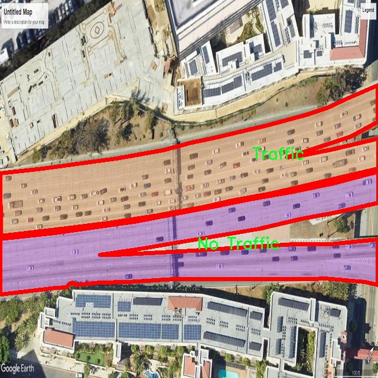

# 交通场景图像分割系统： yolov8-seg-C2f-RFCAConv

### 1.研究背景与意义

[参考博客](https://gitee.com/YOLOv8_YOLOv11_Segmentation_Studio/projects)

[博客来源](https://kdocs.cn/l/cszuIiCKVNis)

研究背景与意义

随着城市化进程的加快，交通问题日益成为全球范围内的一个重要挑战。交通拥堵、交通事故以及环境污染等问题，不仅影响了人们的日常生活质量，也对城市的可持续发展构成了威胁。因此，如何有效地监测和管理交通状况，成为了学术界和工业界亟待解决的课题。在这一背景下，计算机视觉技术，尤其是图像分割技术，逐渐成为交通管理领域的重要工具。图像分割能够将图像中的不同对象进行有效区分，从而为后续的分析和决策提供基础数据。

近年来，YOLO（You Only Look Once）系列模型因其在目标检测领域的卓越表现而受到广泛关注。YOLOv8作为该系列的最新版本，结合了深度学习和计算机视觉的最新进展，具备了更高的检测精度和更快的处理速度。然而，传统的YOLO模型在处理复杂交通场景时，仍然面临着一些挑战，如对重叠物体的识别能力不足、在不同光照和天气条件下的鲁棒性较差等。因此，基于改进YOLOv8的交通场景图像分割系统的研究显得尤为重要。

本研究所使用的数据集“seq-roud”包含2400张图像，涵盖了三种交通场景类别：拥挤街道、无交通和交通状态。这一数据集的多样性为模型的训练和验证提供了丰富的样本，有助于提升模型在不同交通环境下的适应能力。通过对这些图像进行实例分割，可以更精确地识别和定位交通场景中的各类对象，如行人、车辆和交通标志等。这不仅为交通流量分析提供了基础数据，也为智能交通系统的实现奠定了基础。

在实际应用中，基于改进YOLOv8的交通场景图像分割系统可以广泛应用于智能交通监控、自动驾驶、交通流量预测等领域。通过实时监测交通状况，系统能够及时发现交通拥堵、事故等突发情况，并为交通管理部门提供决策支持。此外，该系统还可以为城市规划提供数据支持，帮助相关部门优化交通设施布局，提高城市交通的整体效率。

综上所述，基于改进YOLOv8的交通场景图像分割系统的研究，不仅具有重要的理论意义，也具备广泛的实际应用价值。通过对交通场景的深入分析和研究，我们能够为解决日益严峻的交通问题提供新的思路和方法，推动智能交通技术的发展，促进城市的可持续发展。

### 2.图片演示


注意：本项目提供完整的训练源码数据集和训练教程,由于此博客编辑较早,暂不提供权重文件（best.pt）,需要按照6.训练教程进行训练后实现上图效果。

### 3.视频演示

[3.1 视频演示](https://www.bilibili.com/video/BV1DmzSYaEXs/)

### 4.数据集信息

##### 4.1 数据集类别数＆类别名

nc: 3
names: ['Crowded Street', 'No Traffic', 'Traffic']


##### 4.2 数据集信息简介

数据集信息展示

在本研究中，我们采用了名为“seq-roud”的数据集，以支持对YOLOv8-seg模型在交通场景图像分割任务中的改进和优化。该数据集专注于不同交通状态下的场景，旨在提供丰富的图像数据，以便模型能够学习并准确识别和分割各种交通情况。数据集的类别数量为3，具体类别包括“Crowded Street”（拥挤街道）、“No Traffic”（无交通）和“Traffic”（有交通）。这些类别的设置不仅涵盖了城市交通的多样性，还为模型的训练提供了不同的场景背景和复杂度，确保其在实际应用中的有效性和鲁棒性。

“Crowded Street”类别的图像展示了人流和车流密集的城市街道场景，通常包含大量行人、车辆和其他交通元素。这类图像的特点是复杂的视觉信息和动态变化，给模型的分割任务带来了挑战。通过在这一类别中训练，YOLOv8-seg能够学习到如何在拥挤的环境中准确识别和分割出不同的对象，进而提高其在真实世界应用中的表现。

“Traffic”类别则包含了车辆行驶的场景，通常表现为车流畅通或适度拥堵的情况。这类图像的特征在于交通流的连续性和车辆之间的相对位置，模型需要在分割过程中考虑到车辆的动态变化和相互影响。通过对这一类别的训练，YOLOv8-seg将能够更好地处理不同类型的交通流，提升其在复杂交通环境中的识别能力。

最后，“No Traffic”类别提供了无交通的场景，通常表现为空旷的街道或停车场。这类图像的引入为模型提供了一个基准，帮助其理解在没有干扰物体的情况下，如何进行背景分割。尽管这一类别的复杂性较低，但它在模型的训练过程中同样重要，因为它帮助模型建立起对背景的基本理解，从而在有交通的场景中更好地进行对象分割。

通过对“seq-roud”数据集的深入分析和应用，我们期望能够有效提升YOLOv8-seg在交通场景图像分割任务中的性能。数据集中的多样化场景和丰富的类别信息将为模型提供必要的训练基础，使其能够在不同的交通环境中实现高效、准确的分割。最终，我们的目标是开发出一个能够在实际交通监控和管理中发挥重要作用的图像分割系统，为智能交通系统的建设提供有力支持。





### 5.项目依赖环境部署教程（零基础手把手教学）

[5.1 环境部署教程链接（零基础手把手教学）](https://www.bilibili.com/video/BV1jG4Ve4E9t/?vd_source=bc9aec86d164b67a7004b996143742dc)


[5.2 安装Python虚拟环境创建和依赖库安装视频教程链接（零基础手把手教学）](https://www.bilibili.com/video/BV1nA4VeYEze/?vd_source=bc9aec86d164b67a7004b996143742dc)

### 6.手把手YOLOV8-seg训练视频教程（零基础手把手教学）

[6.1 手把手YOLOV8-seg训练视频教程（零基础小白有手就能学会）](https://www.bilibili.com/video/BV1cA4VeYETe/?vd_source=bc9aec86d164b67a7004b996143742dc)


按照上面的训练视频教程链接加载项目提供的数据集，运行train.py即可开始训练



     Epoch   gpu_mem       box       obj       cls    labels  img_size
     1/200     0G   0.01576   0.01955  0.007536        22      1280: 100%|██████████| 849/849 [14:42<00:00,  1.04s/it]
               Class     Images     Labels          P          R     mAP@.5 mAP@.5:.95: 100%|██████████| 213/213 [01:14<00:00,  2.87it/s]
                 all       3395      17314      0.994      0.957      0.0957      0.0843

     Epoch   gpu_mem       box       obj       cls    labels  img_size
     2/200     0G   0.01578   0.01923  0.007006        22      1280: 100%|██████████| 849/849 [14:44<00:00,  1.04s/it]
               Class     Images     Labels          P          R     mAP@.5 mAP@.5:.95: 100%|██████████| 213/213 [01:12<00:00,  2.95it/s]
                 all       3395      17314      0.996      0.956      0.0957      0.0845

     Epoch   gpu_mem       box       obj       cls    labels  img_size
     3/200     0G   0.01561    0.0191  0.006895        27      1280: 100%|██████████| 849/849 [10:56<00:00,  1.29it/s]
               Class     Images     Labels          P          R     mAP@.5 mAP@.5:.95: 100%|███████   | 187/213 [00:52<00:00,  4.04it/s]
                 all       3395      17314      0.996      0.957      0.0957      0.0845


### 7.50+种全套YOLOV8-seg创新点加载调参实验视频教程（一键加载写好的改进模型的配置文件）

[7.1 50+种全套YOLOV8-seg创新点加载调参实验视频教程（一键加载写好的改进模型的配置文件）](https://www.bilibili.com/video/BV1Hw4VePEXv/?vd_source=bc9aec86d164b67a7004b996143742dc)

### YOLOV8-seg算法简介

原始YOLOV8-seg算法原理

YOLOV8-seg作为YOLO系列的最新版本，旨在提供更高效、更精确的目标检测与分割解决方案。其设计理念不仅关注于目标检测的速度和准确性，还特别考虑了图像分割任务的需求，因而在算法结构上进行了多方面的创新和优化。YOLOV8-seg的核心架构由输入端、主干网络、颈部网络和头部网络四个主要部分构成，每个部分都经过精心设计，以确保在处理复杂场景时能够高效地提取和融合特征。

在输入端，YOLOV8-seg采用了马赛克数据增强技术，这一方法通过将多张图像拼接成一张新的图像，极大地丰富了训练数据的多样性，有助于模型在面对不同背景和目标时保持良好的泛化能力。此外，输入端还实现了自适应锚框计算和自适应灰度填充，这些技术确保了模型能够灵活适应不同输入尺寸和图像特征，从而提升了整体的检测精度。

主干网络是YOLOV8-seg的特征提取核心，其结构的设计灵感来源于YOLOv7中的E-ELAN模块，采用了C2f块来增强特征学习能力。C2f模块通过跨层分支连接的方式，能够有效地增强模型的梯度流动，促进信息的传递和融合。这一设计不仅提高了特征表示能力，还在一定程度上减轻了模型的计算负担。主干网络末尾的空间金字塔池化（SPPF）模块通过多尺度特征的处理，进一步增强了网络对不同尺寸目标的适应能力，使得YOLOV8-seg在复杂场景下依然能够保持较高的检测和分割精度。

颈部网络则是YOLOV8-seg中至关重要的部分，它采用了路径聚合网络（PAN）结构，旨在更好地融合来自不同尺度的特征图信息。通过对特征图的有效整合，颈部网络能够将主干网络提取的多层次特征传递给头部网络，确保目标检测和分割的精确性和一致性。这一设计使得YOLOV8-seg在处理多尺度目标时表现出色，能够有效地识别和分割出不同大小的目标。

在头部网络方面，YOLOV8-seg引入了解耦合的检测头结构，将分类和回归任务分开处理。这一创新使得模型在进行目标检测时能够更为专注于每个任务的细节，提升了分类和回归的准确性。此外，YOLOV8-seg采用了无锚框（Anchor-Free）检测头，减少了对锚框的依赖，从而简化了模型的结构，降低了计算复杂度，并加速了非最大抑制（NMS）过程。这一改进不仅提高了检测速度，也在一定程度上提升了检测精度，尤其是在复杂背景下的目标检测。

在损失计算方面，YOLOV8-seg结合了二元交叉熵损失（BCELoss）作为分类损失，分布焦点损失（DFLoss）和完全交并比损失（CIOULoss）作为回归损失。这种多重损失函数的设计，旨在提升模型对目标边界框的预测精度，确保在目标检测和分割任务中，模型能够更好地学习到目标的真实位置和形状。

综上所述，YOLOV8-seg通过一系列创新的设计和优化，构建了一个高效、精准的目标检测与分割模型。其在输入端的多样化数据增强、主干网络的特征提取能力、颈部网络的特征融合机制以及头部网络的解耦合结构，都为其在复杂场景下的应用奠定了坚实的基础。随着YOLOV8-seg的不断发展和完善，预计其将在智能监控、自动驾驶、医疗影像分析等多个领域发挥越来越重要的作用。


### 9.系统功能展示（检测对象为举例，实际内容以本项目数据集为准）

图9.1.系统支持检测结果表格显示

  图9.2.系统支持置信度和IOU阈值手动调节

  图9.3.系统支持自定义加载权重文件best.pt(需要你通过步骤5中训练获得)

  图9.4.系统支持摄像头实时识别

  图9.5.系统支持图片识别

  图9.6.系统支持视频识别

  图9.7.系统支持识别结果文件自动保存

  图9.8.系统支持Excel导出检测结果数据


### 10.50+种全套YOLOV8-seg创新点原理讲解（非科班也可以轻松写刊发刊，V11版本正在科研待更新）

#### 10.1 由于篇幅限制，每个创新点的具体原理讲解就不一一展开，具体见下列网址中的创新点对应子项目的技术原理博客网址【Blog】：


[10.1 50+种全套YOLOV8-seg创新点原理讲解链接](https://gitee.com/qunmasj/good)

#### 10.2 部分改进模块原理讲解(完整的改进原理见上图和技术博客链接)【如果此小节的图加载失败可以通过CSDN或者Github搜索该博客的标题访问原始博客，原始博客图片显示正常】

### YOLOv8简介
YOLOv8是一种目标检测模型，是基于YOLO (You Only Look Once)系列算法发展而来的最新版本。它的核心思想是将目标检测任务转化为一个回归问题，通过单次前向传播即可直接预测出图像中的多个目标的位置和类别。
YOLOv8的网络结构采用了Darknet作为其主干网络，主要由卷积层和池化层构成。与之前的版本相比，YOLOv8在网络结构上进行了改进，引入了更多的卷积层和残差模块，以提高模型的准确性和鲁棒性。
YOLOv8采用了一种特征金字塔网络(Feature Pyramid Network,FPN)的结构，通过在不同层级上融合多尺度的特征信息，可以对不同尺度的目标进行有效的检测。此外，YOLOv8还引入了一种自适应感知域(Adaptive Anchors
的机制，通过自适应地学习目标的尺度和
长宽比，提高了模型对于不同尺度和形状目标的检测效果。
总体来说，YOLOv8结构模型综合了多个先进的目标检测技术，在保证检测速度的同时提升了检测精度和鲁棒性，被广泛应用于实时目标检测任务中。


#### yolov8网络模型结构图

YOLOv8 (You Only Look Once version 8)是一种目标检测算法，它在实时场景下可以快速准确地检测图像中的目标。
YOLOv8的网络模型结构基于Darknet框架，由一系列卷积层、池化层和全连接层组成。主要包含以下几个组件:
1.输入层:接收输入图像。
2.卷积层:使用不同尺寸的卷积核来提取图像特征。
3.残差块(Residual blocks):通过使用跳跃连接(skip connections）来解决梯度消失问题，使得网络更容易训练。
4.上采样层(Upsample layers):通过插值操作将特征图的尺寸放大，以便在不同尺度上进行目标检测。
5.池化层:用于减小特征图的尺寸，同时保留重要的特征。
6.1x1卷积层:用于降低通道数，减少网络参数量。
7.3x3卷积层:用于进—步提取和组合特征。
8.全连接层:用于最后的目标分类和定位。
YOLOv8的网络结构采用了多个不同尺度的特征图来检测不同大小的目标，从而提高了目标检测的准确性和多尺度性能。
请注意，YOLOv8网络模型结构图的具体细节可能因YOLO版本和实现方式而有所不同。


#### yolov8模型结构
YOLOv8模型是一种目标检测模型，其结构是基于YOLOv3模型进行改进的。模型结构可以分为主干网络和检测头两个部分。
主干网络是一种由Darknet-53构成的卷积神经网络。Darknet-53是一个经过多层卷积和残差连接构建起来的深度神经网络。它能够提取图像的特征信息，并将这些信息传递给检测头。
检测头是YOLOv8的关键部分，它负责在图像中定位和识别目标。检测头由一系列卷积层和全连接层组成。在每个检测头中，会生成一组锚框，并针对每个锚框预测目标的类别和位置信息。
YOLOv8模型使用了预训练的权重，其中在COCO数据集上进行了训练。这意味着该模型已经通过大规模数据集的学习，具有一定的目标检测能力。

### RT-DETR骨干网络HGNetv2简介
#### RT-DETR横空出世
前几天被百度的RT-DETR刷屏，参考该博客提出的目标检测新范式对原始DETR的网络结构进行了调整和优化，以提高计算速度和减小模型大小。这包括使用更轻量级的基础网络和调整Transformer结构。并且，摒弃了nms处理的detr结构与传统的物体检测方法相比，不仅训练是端到端的，检测也能端到端，这意味着整个网络在训练过程中一起进行优化，推理过程不需要昂贵的后处理代价，这有助于提高模型的泛化能力和性能。


当然，人们对RT-DETR之所以产生浓厚的兴趣，我觉得大概率还是对YOLO系列审美疲劳了，就算是出到了YOLO10086，我还是只想用YOLOv5和YOLOv7的框架来魔改做业务。。

#### 初识HGNet
看到RT-DETR的性能指标，发现指标最好的两个模型backbone都是用的HGNetv2，毫无疑问，和当时的picodet一样，骨干都是使用百度自家的网络。初识HGNet的时候，当时是参加了第四届百度网盘图像处理大赛，文档图像方向识别专题赛道，简单来说，就是使用分类网络对一些文档截图或者图片进行方向角度分类。


当时的方案并没有那么快定型，通常是打榜过程发现哪个网络性能好就使用哪个网络做魔改，而且木有显卡，只能蹭Ai Studio的平台，不过v100一天8小时的实验时间有点短，这也注定了大模型用不了。 

流水的模型，铁打的炼丹人，最后发现HGNet-tiny各方面指标都很符合我们的预期，后面就一直围绕它魔改。当然，比赛打榜是目的，学习才是享受过程，当时看到效果还可以，便开始折腾起了HGNet的网络架构，我们可以看到，PP-HGNet 针对 GPU 设备，对目前 GPU 友好的网络做了分析和归纳，尽可能多的使用 3x3 标准卷积（计算密度最高），PP-HGNet是由多个HG-Block组成，细节如下：


ConvBNAct是啥？简单聊一聊，就是Conv+BN+Act，CV Man应该最熟悉不过了：
```python
class ConvBNAct(TheseusLayer):
    def __init__(self,
                 in_channels,
                 out_channels,
                 kernel_size,
                 stride,
                 groups=1,
                 use_act=True):
        super().__init__()
        self.use_act = use_act
        self.conv = Conv2D(
            in_channels,
            out_channels,
            kernel_size,
            stride,
            padding=(kernel_size - 1) // 2,
            groups=groups,
            bias_attr=False)
        self.bn = BatchNorm2D(
            out_channels,
            weight_attr=ParamAttr(regularizer=L2Decay(0.0)),
            bias_attr=ParamAttr(regularizer=L2Decay(0.0)))
        if self.use_act:
            self.act = ReLU()
 
    def forward(self, x):
        x = self.conv(x)
        x = self.bn(x)
        if self.use_act:
            x = self.act(x)
        return x 
```
且标准卷积的数量随层数深度增加而增多，从而得到一个有利于 GPU 推理的骨干网络，同样速度下，精度也超越其他 CNN ，性价比也优于ViT-base模型。


另外，我们可以看到：

PP-HGNet 的第一层由channel为96的Stem模块构成，目的是为了减少参数量和计算量。PP-HGNet

Tiny的整体结构由四个HG Stage构成，而每个HG Stage主要由包含大量标准卷积的HG Block构成。

PP-HGNet的第三到第五层使用了使用了可学习的下采样层（LDS Layer），该层group为输入通道数，可达到降参降计算量的作用，且Tiny模型仅包含三个LDS Layer，并不会对GPU的利用率造成较大影响.

PP-HGNet的激活函数为Relu，常数级操作可保证该模型在硬件上的推理速度。

### 11.项目核心源码讲解（再也不用担心看不懂代码逻辑）

#### 11.1 demo_test_camera.py

以下是对给定代码的核心部分进行提炼和详细注释的结果：

```python
import cv2
import numpy as np
from PIL import ImageFont, ImageDraw, Image
from hashlib import md5
from model import Web_Detector
from chinese_name_list import Label_list

def generate_color_based_on_name(name):
    """
    根据名称生成稳定的颜色
    :param name: 输入的名称
    :return: 生成的颜色，格式为BGR
    """
    hash_object = md5(name.encode())  # 使用MD5哈希函数
    hex_color = hash_object.hexdigest()[:6]  # 取前6位16进制数
    r, g, b = int(hex_color[0:2], 16), int(hex_color[2:4], 16), int(hex_color[4:6], 16)
    return (b, g, r)  # OpenCV使用BGR格式

def draw_with_chinese(image, text, position, font_size=20, color=(255, 0, 0)):
    """
    在图像上绘制中文文本
    :param image: 输入图像
    :param text: 要绘制的文本
    :param position: 文本位置
    :param font_size: 字体大小
    :param color: 字体颜色
    :return: 绘制了文本的图像
    """
    image_pil = Image.fromarray(cv2.cvtColor(image, cv2.COLOR_BGR2RGB))  # 转换为PIL格式
    draw = ImageDraw.Draw(image_pil)  # 创建绘图对象
    font = ImageFont.truetype("simsun.ttc", font_size, encoding="unic")  # 加载中文字体
    draw.text(position, text, font=font, fill=color)  # 绘制文本
    return cv2.cvtColor(np.array(image_pil), cv2.COLOR_RGB2BGR)  # 转换回OpenCV格式

def draw_detections(image, info):
    """
    在图像上绘制检测结果，包括边框、类别名称和其他信息
    :param image: 输入图像
    :param info: 检测信息，包括类别名称、边界框、置信度等
    :return: 绘制了检测结果的图像
    """
    name, bbox = info['class_name'], info['bbox']  # 提取类别名称和边界框
    x1, y1, x2, y2 = bbox  # 解包边界框坐标
    cv2.rectangle(image, (x1, y1), (x2, y2), color=(0, 0, 255), thickness=3)  # 绘制边界框
    image = draw_with_chinese(image, name, (x1, y1 - 10), font_size=20)  # 绘制类别名称
    return image

def process_frame(model, image):
    """
    处理每一帧图像，进行目标检测并绘制结果
    :param model: 目标检测模型
    :param image: 输入图像
    :return: 处理后的图像
    """
    pre_img = model.preprocess(image)  # 预处理图像
    pred = model.predict(pre_img)  # 进行预测
    det = pred[0]  # 获取检测结果

    if det is not None and len(det):
        det_info = model.postprocess(pred)  # 后处理获取检测信息
        for info in det_info:
            image = draw_detections(image, info)  # 绘制检测结果
    return image

if __name__ == "__main__":
    model = Web_Detector()  # 初始化模型
    model.load_model("./weights/yolov8s-seg.pt")  # 加载模型权重

    # 摄像头实时处理
    cap = cv2.VideoCapture(0)  # 打开摄像头
    while cap.isOpened():
        ret, frame = cap.read()  # 读取一帧
        if not ret:
            break
        processed_frame = process_frame(model, frame)  # 处理帧
        cv2.imshow('Camera Feed', processed_frame)  # 显示处理后的帧
        if cv2.waitKey(1) & 0xFF == ord('q'):  # 按'q'退出
            break
    cap.release()  # 释放摄像头
    cv2.destroyAllWindows()  # 关闭所有窗口
```

### 代码核心部分分析
1. **生成颜色**：`generate_color_based_on_name` 函数通过对名称进行哈希处理生成一个稳定的颜色，确保同一名称每次生成的颜色一致。
2. **绘制中文文本**：`draw_with_chinese` 函数使用PIL库在图像上绘制中文文本，确保中文显示正常。
3. **绘制检测结果**：`draw_detections` 函数负责在图像上绘制目标检测的边界框和类别名称。
4. **处理每一帧**：`process_frame` 函数负责对每一帧图像进行预处理、预测和后处理，最终返回绘制了检测结果的图像。
5. **主程序**：在主程序中，初始化模型并通过摄像头实时捕获图像，处理每一帧并显示结果。

通过这些核心部分，代码实现了一个简单的目标检测系统，能够实时处理摄像头输入并显示检测结果。

这个程序文件 `demo_test_camera.py` 是一个用于实时视频处理的脚本，主要功能是通过摄像头捕捉视频流，并使用一个深度学习模型进行目标检测和分割。程序的整体结构可以分为几个部分，包括导入库、定义辅助函数、处理视频帧以及主程序逻辑。

首先，程序导入了一些必要的库，包括 `random`、`cv2`（OpenCV）、`numpy`、`PIL`（用于处理图像字体和绘制）、`hashlib`（用于生成哈希值）以及自定义的 `Web_Detector` 模型和标签列表 `Label_list`。这些库为后续的图像处理和模型推理提供了支持。

接下来，程序定义了一些辅助函数。`generate_color_based_on_name` 函数通过对名称进行哈希处理，生成一个稳定的颜色值，确保同一名称在图像中显示时颜色一致。`calculate_polygon_area` 函数计算给定点集（多边形）的面积，`draw_with_chinese` 函数则用于在图像上绘制中文文本，支持自定义字体和颜色。

`adjust_parameter` 函数根据图像的大小调整参数，以确保绘制的元素在不同分辨率下保持合适的比例。`draw_detections` 函数是核心部分，它负责在图像上绘制检测到的目标，包括边界框、类别名称、面积、周长、圆度和颜色值等信息。该函数根据目标是否有掩膜（mask）来选择不同的绘制方式，如果有掩膜，则会绘制多边形并计算相关的几何特征。

`process_frame` 函数用于处理每一帧图像。它首先对图像进行预处理，然后通过模型进行预测，接着对检测结果进行后处理，并调用 `draw_detections` 函数在图像上绘制检测结果。

在主程序部分，首先加载模型并初始化摄像头。通过 `cv2.VideoCapture(0)` 打开默认摄像头，并在一个循环中不断读取视频帧。每读取一帧，就调用 `process_frame` 函数进行处理，并通过 `cv2.imshow` 显示处理后的图像。如果用户按下 'q' 键，程序将退出循环，释放摄像头资源并关闭所有窗口。

总体来说，这个程序实现了一个实时目标检测和分割的应用，能够在摄像头捕捉到的图像上实时显示检测结果，适用于各种计算机视觉任务。

#### 11.2 ultralytics\trackers\byte_tracker.py

以下是代码中最核心的部分，并附上详细的中文注释：

```python
class STrack(BaseTrack):
    """
    单目标跟踪表示，使用卡尔曼滤波进行状态估计。

    该类负责存储有关单个跟踪片段的所有信息，并根据卡尔曼滤波器执行状态更新和预测。
    """

    shared_kalman = KalmanFilterXYAH()  # 共享的卡尔曼滤波器实例，用于所有STrack实例的预测

    def __init__(self, tlwh, score, cls):
        """初始化新的STrack实例。"""
        # 将输入的边界框转换为tlwh格式并存储
        self._tlwh = np.asarray(self.tlbr_to_tlwh(tlwh[:-1]), dtype=np.float32)
        self.kalman_filter = None  # 卡尔曼滤波器实例
        self.mean, self.covariance = None, None  # 状态均值和协方差
        self.is_activated = False  # 跟踪是否已激活

        self.score = score  # 跟踪的置信度分数
        self.tracklet_len = 0  # 跟踪片段的长度
        self.cls = cls  # 目标类别
        self.idx = tlwh[-1]  # 目标索引

    def predict(self):
        """使用卡尔曼滤波器预测目标的下一个状态。"""
        mean_state = self.mean.copy()  # 复制当前均值状态
        if self.state != TrackState.Tracked:  # 如果状态不是跟踪状态
            mean_state[7] = 0  # 将速度设置为0
        # 使用卡尔曼滤波器进行预测
        self.mean, self.covariance = self.kalman_filter.predict(mean_state, self.covariance)

    def activate(self, kalman_filter, frame_id):
        """启动新的跟踪片段。"""
        self.kalman_filter = kalman_filter  # 设置卡尔曼滤波器
        self.track_id = self.next_id()  # 获取下一个跟踪ID
        # 初始化卡尔曼滤波器的状态
        self.mean, self.covariance = self.kalman_filter.initiate(self.convert_coords(self._tlwh))

        self.tracklet_len = 0  # 重置跟踪片段长度
        self.state = TrackState.Tracked  # 设置状态为跟踪
        if frame_id == 1:
            self.is_activated = True  # 如果是第一帧，则激活跟踪
        self.frame_id = frame_id  # 设置当前帧ID
        self.start_frame = frame_id  # 设置开始帧ID

    def update(self, new_track, frame_id):
        """
        更新匹配跟踪的状态。

        参数:
            new_track (STrack): 包含更新信息的新跟踪。
            frame_id (int): 当前帧的ID。
        """
        self.frame_id = frame_id  # 更新当前帧ID
        self.tracklet_len += 1  # 增加跟踪片段长度

        new_tlwh = new_track.tlwh  # 获取新的边界框
        # 使用卡尔曼滤波器更新状态
        self.mean, self.covariance = self.kalman_filter.update(self.mean, self.covariance,
                                                               self.convert_coords(new_tlwh))
        self.state = TrackState.Tracked  # 设置状态为跟踪
        self.is_activated = True  # 激活跟踪

        self.score = new_track.score  # 更新置信度分数
        self.cls = new_track.cls  # 更新目标类别
        self.idx = new_track.idx  # 更新目标索引

    @staticmethod
    def tlwh_to_xyah(tlwh):
        """将边界框转换为格式 (中心x, 中心y, 宽高比, 高度)。"""
        ret = np.asarray(tlwh).copy()  # 复制输入的tlwh格式
        ret[:2] += ret[2:] / 2  # 计算中心坐标
        ret[2] /= ret[3]  # 计算宽高比
        return ret  # 返回转换后的结果
```

### 代码核心部分说明：
1. **STrack类**：负责单个目标的跟踪，使用卡尔曼滤波器进行状态预测和更新。
2. **初始化方法**：接受边界框、置信度和类别，初始化跟踪状态。
3. **预测方法**：使用卡尔曼滤波器预测目标的下一个状态。
4. **激活方法**：开始新的跟踪片段，初始化卡尔曼滤波器的状态。
5. **更新方法**：更新当前跟踪状态，使用新的检测信息。
6. **坐标转换方法**：将边界框从tlwh格式转换为xyah格式，以便于后续处理。

这些方法和属性构成了STrack类的核心功能，使其能够有效地跟踪视频中的目标。

这个程序文件 `byte_tracker.py` 实现了一个基于 Kalman 滤波器的单目标跟踪算法，名为 BYTETracker，主要用于视频序列中对象的检测和跟踪。文件中定义了两个主要的类：`STrack` 和 `BYTETracker`。

`STrack` 类表示单个对象的跟踪，使用 Kalman 滤波器进行状态估计。它负责存储与每个跟踪对象相关的信息，包括边界框的坐标、置信度分数、跟踪状态等。该类的构造函数接收边界框信息、置信度分数和类别标签，并初始化相应的属性。`STrack` 还提供了一系列方法用于预测下一个状态、激活跟踪、更新状态等。通过 Kalman 滤波器，`STrack` 可以在每一帧中预测对象的位置，并根据新的检测结果更新其状态。

`BYTETracker` 类则是整个跟踪算法的核心，负责管理多个 `STrack` 实例。它初始化跟踪器、更新跟踪状态，并维护被跟踪、丢失和移除的轨迹。该类的构造函数接收参数和帧率，并初始化一些跟踪状态的列表。`update` 方法是该类的主要功能，接收新的检测结果并更新当前帧的跟踪状态。它首先对检测结果进行筛选，然后通过计算轨迹与检测之间的距离，使用匈牙利算法进行数据关联。接着，`BYTETracker` 会处理丢失的轨迹和未确认的轨迹，更新它们的状态，并根据条件激活新的轨迹。

文件中还定义了一些辅助方法，例如计算轨迹与检测之间的距离、合并和过滤轨迹列表等。这些方法帮助实现了跟踪的逻辑，使得 BYTETracker 能够在复杂的场景中有效地进行对象跟踪。

总的来说，这个文件实现了一个高效的对象跟踪算法，结合了 Kalman 滤波器和 YOLOv8 的检测能力，适用于实时视频分析中的目标跟踪任务。

#### 11.3 ultralytics\models\sam\build.py

以下是代码中最核心的部分，并附上详细的中文注释：

```python
import torch
from functools import partial

from .modules.decoders import MaskDecoder
from .modules.encoders import ImageEncoderViT, PromptEncoder
from .modules.sam import Sam
from .modules.tiny_encoder import TinyViT
from .modules.transformer import TwoWayTransformer

def _build_sam(encoder_embed_dim,
               encoder_depth,
               encoder_num_heads,
               encoder_global_attn_indexes,
               checkpoint=None,
               mobile_sam=False):
    """构建所选的SAM模型架构。"""
    
    # 定义提示嵌入维度和图像大小
    prompt_embed_dim = 256
    image_size = 1024
    vit_patch_size = 16
    image_embedding_size = image_size // vit_patch_size  # 计算图像嵌入大小

    # 根据是否为移动SAM选择不同的图像编码器
    image_encoder = (TinyViT(
        img_size=1024,
        in_chans=3,
        num_classes=1000,
        embed_dims=encoder_embed_dim,
        depths=encoder_depth,
        num_heads=encoder_num_heads,
        window_sizes=[7, 7, 14, 7],
        mlp_ratio=4.0,
        drop_rate=0.0,
        drop_path_rate=0.0,
        use_checkpoint=False,
        mbconv_expand_ratio=4.0,
        local_conv_size=3,
    ) if mobile_sam else ImageEncoderViT(
        depth=encoder_depth,
        embed_dim=encoder_embed_dim,
        img_size=image_size,
        mlp_ratio=4,
        norm_layer=partial(torch.nn.LayerNorm, eps=1e-6),
        num_heads=encoder_num_heads,
        patch_size=vit_patch_size,
        qkv_bias=True,
        use_rel_pos=True,
        global_attn_indexes=encoder_global_attn_indexes,
        window_size=14,
        out_chans=prompt_embed_dim,
    ))

    # 创建SAM模型实例
    sam = Sam(
        image_encoder=image_encoder,  # 使用选择的图像编码器
        prompt_encoder=PromptEncoder(
            embed_dim=prompt_embed_dim,
            image_embedding_size=(image_embedding_size, image_embedding_size),
            input_image_size=(image_size, image_size),
            mask_in_chans=16,
        ),
        mask_decoder=MaskDecoder(
            num_multimask_outputs=3,
            transformer=TwoWayTransformer(
                depth=2,
                embedding_dim=prompt_embed_dim,
                mlp_dim=2048,
                num_heads=8,
            ),
            transformer_dim=prompt_embed_dim,
            iou_head_depth=3,
            iou_head_hidden_dim=256,
        ),
        pixel_mean=[123.675, 116.28, 103.53],  # 图像预处理的均值
        pixel_std=[58.395, 57.12, 57.375],      # 图像预处理的标准差
    )

    # 如果提供了检查点，则加载模型权重
    if checkpoint is not None:
        checkpoint = attempt_download_asset(checkpoint)  # 尝试下载检查点
        with open(checkpoint, 'rb') as f:
            state_dict = torch.load(f)  # 加载模型状态字典
        sam.load_state_dict(state_dict)  # 将状态字典加载到模型中

    sam.eval()  # 设置模型为评估模式
    return sam  # 返回构建的SAM模型
```

### 代码核心部分说明：
1. **导入必要的模块**：引入了PyTorch和一些自定义模块，这些模块用于构建和处理模型。
2. **_build_sam函数**：这是构建SAM模型的核心函数，接受多个参数以定义模型的架构。
   - **参数说明**：
     - `encoder_embed_dim`：编码器的嵌入维度。
     - `encoder_depth`：编码器的深度。
     - `encoder_num_heads`：编码器的头数。
     - `encoder_global_attn_indexes`：全局注意力索引。
     - `checkpoint`：可选的模型检查点路径。
     - `mobile_sam`：布尔值，指示是否构建移动版本的SAM。
3. **图像编码器选择**：根据是否为移动版本选择不同的图像编码器（TinyViT或ImageEncoderViT）。
4. **SAM模型实例化**：创建SAM模型实例，包含图像编码器、提示编码器和掩码解码器。
5. **加载模型权重**：如果提供了检查点，尝试下载并加载模型的权重。
6. **模型评估模式**：将模型设置为评估模式，以便在推理时使用。

这个程序文件是用于构建“Segment Anything Model”（SAM）的，主要包括不同大小的模型构建函数和一些辅助功能。首先，文件引入了一些必要的库和模块，包括`torch`和一些自定义的模块，如`MaskDecoder`、`ImageEncoderViT`、`PromptEncoder`等，这些模块是构建SAM模型的基础组件。

文件中定义了多个函数来构建不同大小的SAM模型，包括`build_sam_vit_h`、`build_sam_vit_l`、`build_sam_vit_b`和`build_mobile_sam`。每个函数调用了一个私有函数`_build_sam`，并传入特定的参数，如编码器的嵌入维度、深度、头数和全局注意力索引等。这些参数决定了模型的结构和复杂度。

`_build_sam`函数是模型构建的核心，首先定义了一些固定的参数，比如提示嵌入维度、图像大小和图像嵌入大小。根据`mobile_sam`的标志，函数会选择使用`TinyViT`或`ImageEncoderViT`作为图像编码器。接着，函数创建了一个`Sam`对象，该对象由图像编码器、提示编码器和掩码解码器组成。掩码解码器使用了一个双向变换器来处理掩码输出。

如果提供了检查点（checkpoint），函数会尝试下载并加载模型的状态字典，以便恢复模型的训练状态。最后，模型被设置为评估模式，并返回构建好的SAM模型。

在文件的最后部分，定义了一个字典`samm_model_map`，将模型文件名映射到相应的构建函数。`build_sam`函数根据给定的检查点名称选择合适的模型构建函数，并返回构建好的模型。如果检查点不在支持的模型列表中，则会抛出一个文件未找到的异常。

总体而言，这个文件提供了一种灵活的方式来构建和加载不同配置的SAM模型，适用于各种图像分割任务。

#### 11.4 ultralytics\nn\extra_modules\ops_dcnv3\functions\dcnv3_func.py

以下是保留的核心代码部分，并附上详细的中文注释：

```python
import torch
import torch.nn.functional as F
from torch.autograd import Function
from torch.cuda.amp import custom_bwd, custom_fwd

class DCNv3Function(Function):
    @staticmethod
    @custom_fwd
    def forward(ctx, input, offset, mask, kernel_h, kernel_w, stride_h, stride_w, pad_h, pad_w, dilation_h, dilation_w, group, group_channels, offset_scale, im2col_step, remove_center):
        # 保存卷积参数到上下文中，以便在反向传播时使用
        ctx.kernel_h = kernel_h
        ctx.kernel_w = kernel_w
        ctx.stride_h = stride_h
        ctx.stride_w = stride_w
        ctx.pad_h = pad_h
        ctx.pad_w = pad_w
        ctx.dilation_h = dilation_h
        ctx.dilation_w = dilation_w
        ctx.group = group
        ctx.group_channels = group_channels
        ctx.offset_scale = offset_scale
        ctx.im2col_step = im2col_step
        ctx.remove_center = remove_center

        # 准备参数并调用DCNv3的前向计算
        args = [input, offset, mask, kernel_h, kernel_w, stride_h, stride_w, pad_h, pad_w, dilation_h, dilation_w, group, group_channels, offset_scale, ctx.im2col_step]
        if remove_center:
            args.append(remove_center)

        output = DCNv3.dcnv3_forward(*args)  # 调用DCNv3的前向计算
        ctx.save_for_backward(input, offset, mask)  # 保存输入张量以便反向传播使用

        return output

    @staticmethod
    @custom_bwd
    def backward(ctx, grad_output):
        # 从上下文中获取保存的张量
        input, offset, mask = ctx.saved_tensors

        # 准备反向传播所需的参数
        args = [input, offset, mask, ctx.kernel_h, ctx.kernel_w, ctx.stride_h, ctx.stride_w, ctx.pad_h, ctx.pad_w, ctx.dilation_h, ctx.dilation_w, ctx.group, ctx.group_channels, ctx.offset_scale, grad_output.contiguous(), ctx.im2col_step]
        if ctx.remove_center:
            args.append(ctx.remove_center)

        # 调用DCNv3的反向计算
        grad_input, grad_offset, grad_mask = DCNv3.dcnv3_backward(*args)

        return grad_input, grad_offset, grad_mask, None, None, None, None, None, None, None, None, None, None, None, None

def dcnv3_core_pytorch(input, offset, mask, kernel_h, kernel_w, stride_h, stride_w, pad_h, pad_w, dilation_h, dilation_w, group, group_channels, offset_scale, remove_center):
    # 对输入进行填充
    input = F.pad(input, [0, 0, pad_h, pad_h, pad_w, pad_w])
    N_, H_in, W_in, _ = input.shape  # 获取输入的形状
    _, H_out, W_out, _ = offset.shape  # 获取偏移量的形状

    # 计算参考点和采样网格
    ref = _get_reference_points(input.shape, input.device, kernel_h, kernel_w, dilation_h, dilation_w, pad_h, pad_w, stride_h, stride_w)
    grid = _generate_dilation_grids(input.shape, kernel_h, kernel_w, dilation_h, dilation_w, group, input.device)

    # 计算采样位置
    sampling_locations = (ref + grid * offset_scale).repeat(N_, 1, 1, 1, 1)
    if remove_center:
        sampling_locations = remove_center_sampling_locations(sampling_locations, kernel_w=kernel_w, kernel_h=kernel_h)
    sampling_locations = sampling_locations.flatten(3, 4)  # 展平采样位置

    # 进行双线性插值采样
    input_ = input.view(N_, H_in * W_in, group * group_channels).transpose(1, 2).reshape(N_ * group, group_channels, H_in, W_in)
    sampling_input_ = F.grid_sample(input_, sampling_locations, mode='bilinear', padding_mode='zeros', align_corners=False)

    # 计算输出
    mask = mask.view(N_, H_out * W_out, group, -1).transpose(1, 2).reshape(N_ * group, 1, H_out * W_out, -1)
    output = (sampling_input_ * mask).sum(-1).view(N_, group * group_channels, H_out * W_out)

    return output.transpose(1, 2).reshape(N_, H_out, W_out, -1).contiguous()  # 返回最终输出
```

### 代码说明：
1. **DCNv3Function类**：定义了一个自定义的PyTorch函数，包含前向和反向传播的实现。
   - `forward`方法：处理输入、偏移量和掩码，调用DCNv3的前向计算，并保存必要的参数以供反向传播使用。
   - `backward`方法：处理梯度计算，调用DCNv3的反向计算，返回输入、偏移量和掩码的梯度。

2. **dcnv3_core_pytorch函数**：实现了DCNv3的核心逻辑，包括输入填充、参考点和采样网格的计算、采样位置的生成以及最终的输出计算。

这个程序文件是一个实现深度学习中动态卷积（DCNv3）功能的PyTorch自定义操作。文件的主要内容包括定义DCNv3的前向和反向传播函数，以及一些辅助函数，用于计算参考点、生成膨胀网格和处理采样位置。

首先，文件导入了必要的库，包括PyTorch及其功能模块。它还尝试导入DCNv3库，并获取其版本信息，以便在后续操作中进行版本检查。

`DCNv3Function`类继承自`Function`，定义了DCNv3的前向和反向传播逻辑。在前向传播中，首先将输入参数保存到上下文`ctx`中，然后调用DCNv3的前向函数`dcnv3_forward`，并将输入、偏移量、掩码等参数传递给它。前向传播的输出会被返回，并且输入、偏移量和掩码会被保存以供反向传播使用。

在反向传播中，首先从上下文中恢复保存的张量，然后构造反向传播所需的参数，调用DCNv3的反向函数`dcnv3_backward`，计算输入、偏移量和掩码的梯度，并返回这些梯度。

`symbolic`方法用于在ONNX中生成DCNv3操作的符号表示，便于模型的导出和部署。

接下来的几个辅助函数用于计算参考点、生成膨胀网格和处理采样位置。`_get_reference_points`函数根据输入的空间形状和卷积参数计算参考点，这些参考点用于后续的采样操作。`_generate_dilation_grids`函数生成膨胀网格，帮助在卷积过程中进行采样。`remove_center_sampling_locations`函数用于去除中心采样位置，确保在特定条件下的采样有效性。

最后，`dcnv3_core_pytorch`函数实现了DCNv3的核心逻辑，包括输入的填充、参考点和采样网格的计算、以及最终的采样和输出生成。该函数的实现中，首先对输入进行填充，然后计算参考点和膨胀网格，接着生成采样位置，并通过`F.grid_sample`函数进行采样，最后将结果与掩码相乘并进行形状变换，得到最终的输出。

整体而言，这个文件实现了DCNv3的关键功能，提供了灵活的卷积操作，适用于各种深度学习任务，尤其是在目标检测和图像分割等领域。

#### 11.5 ultralytics\utils\instance.py

以下是代码中最核心的部分，并附上详细的中文注释：

```python
import numpy as np

class Bboxes:
    """
    处理边界框的类，支持多种边界框格式，如 'xyxy'、'xywh' 和 'ltwh'。
    边界框数据应以 numpy 数组的形式提供。

    属性:
        bboxes (numpy.ndarray): 存储边界框的二维 numpy 数组。
        format (str): 边界框的格式 ('xyxy'、'xywh' 或 'ltwh')。
    """

    def __init__(self, bboxes, format='xyxy') -> None:
        """使用指定格式的边界框数据初始化 Bboxes 类。"""
        # 确保格式有效
        assert format in ['xyxy', 'xywh', 'ltwh'], f'无效的边界框格式: {format}'
        # 如果输入是一维数组，则将其转换为二维数组
        bboxes = bboxes[None, :] if bboxes.ndim == 1 else bboxes
        # 确保输入为二维数组且每个边界框有四个坐标
        assert bboxes.ndim == 2
        assert bboxes.shape[1] == 4
        self.bboxes = bboxes  # 存储边界框
        self.format = format  # 存储边界框格式

    def convert(self, format):
        """将边界框格式从一种类型转换为另一种类型。"""
        assert format in ['xyxy', 'xywh', 'ltwh'], f'无效的边界框格式: {format}'
        if self.format == format:
            return  # 如果格式相同，则不需要转换
        # 根据当前格式和目标格式选择转换函数
        if self.format == 'xyxy':
            func = xyxy2xywh if format == 'xywh' else xyxy2ltwh
        elif self.format == 'xywh':
            func = xywh2xyxy if format == 'xyxy' else xywh2ltwh
        else:
            func = ltwh2xyxy if format == 'xyxy' else ltwh2xywh
        self.bboxes = func(self.bboxes)  # 执行转换
        self.format = format  # 更新格式

    def areas(self):
        """返回每个边界框的面积。"""
        self.convert('xyxy')  # 确保边界框格式为 'xyxy'
        # 计算面积：宽 * 高
        return (self.bboxes[:, 2] - self.bboxes[:, 0]) * (self.bboxes[:, 3] - self.bboxes[:, 1])

    def __len__(self):
        """返回边界框的数量。"""
        return len(self.bboxes)

class Instances:
    """
    存储图像中检测到的对象的边界框、分段和关键点的容器。

    属性:
        _bboxes (Bboxes): 处理边界框操作的内部对象。
        keypoints (ndarray): 关键点 (x, y, visible)，形状为 [N, 17, 3]。默认为 None。
        segments (ndarray): 经过重采样的分段数组，形状为 [N, 1000, 2]。
    """

    def __init__(self, bboxes, segments=None, keypoints=None, bbox_format='xywh', normalized=True) -> None:
        """
        初始化实例对象。

        参数:
            bboxes (ndarray): 形状为 [N, 4] 的边界框数组。
            segments (list | ndarray): 对象分段的列表或数组。默认为 None。
            keypoints (ndarray): 形状为 [N, 17, 3] 的关键点数组。默认为 None。
        """
        self._bboxes = Bboxes(bboxes=bboxes, format=bbox_format)  # 初始化边界框
        self.keypoints = keypoints  # 存储关键点
        self.normalized = normalized  # 标记是否归一化

        # 处理分段数据
        if segments is None:
            segments = []
        if len(segments) > 0:
            segments = resample_segments(segments)  # 重采样分段
            segments = np.stack(segments, axis=0)  # 转换为数组
        else:
            segments = np.zeros((0, 1000, 2), dtype=np.float32)  # 默认分段为空
        self.segments = segments  # 存储分段数据

    @property
    def bboxes(self):
        """返回边界框。"""
        return self._bboxes.bboxes  # 返回边界框数据
```

### 代码核心部分说明：
1. **Bboxes 类**：用于处理边界框的类，支持多种格式，提供了初始化、格式转换和面积计算等功能。
2. **Instances 类**：用于存储和处理图像中检测到的对象的边界框、分段和关键点，支持初始化和处理分段数据。
3. **属性和方法**：每个类都有相关的属性和方法，便于管理和操作边界框及其相关数据。

这个程序文件是一个用于处理边界框（bounding boxes）和实例（instances）的类库，主要用于计算机视觉任务中，如目标检测。文件中定义了两个主要的类：`Bboxes`和`Instances`，它们分别用于处理边界框和图像中检测到的对象的实例。

首先，`Bboxes`类用于管理边界框，支持多种格式，包括`xyxy`（左上角和右下角坐标）、`xywh`（中心坐标和宽高）以及`ltwh`（左上角坐标和宽高）。在初始化时，`Bboxes`类会验证输入的格式，并确保边界框数据是一个二维的NumPy数组。该类提供了多种方法来转换边界框格式、计算面积、缩放、添加偏移量等操作。特别地，`convert`方法可以将边界框从一种格式转换为另一种格式，`areas`方法则计算每个边界框的面积。

`Instances`类则是一个更高级的容器，除了包含边界框外，还可以存储对象的分段（segments）和关键点（keypoints）。在初始化时，`Instances`类会处理输入的边界框、分段和关键点，并确保它们的形状和格式正确。该类同样提供了多种方法来转换边界框格式、缩放、归一化和去归一化边界框、分段和关键点等。它还支持通过索引获取特定的实例或一组实例。

此外，两个类都提供了拼接功能，可以将多个`Bboxes`或`Instances`对象合并为一个新的对象。`Bboxes`类的`concatenate`方法和`Instances`类的`concatenate`方法都可以实现这一点。

总的来说，这个文件提供了一个灵活且功能强大的工具集，用于处理和操作边界框及其相关数据，适用于目标检测等计算机视觉任务。通过使用NumPy数组，程序能够高效地处理大量数据，并提供多种便捷的方法来进行各种操作。

### 12.系统整体结构（节选）

### 整体功能和构架概括

该项目主要集中在计算机视觉领域，特别是目标检测和图像分割任务。整体架构由多个模块组成，每个模块负责特定的功能，形成一个完整的工作流。项目的核心功能包括实时视频处理、目标跟踪、模型构建、动态卷积操作以及边界框和实例管理。

1. **实时视频处理**：`demo_test_camera.py` 负责从摄像头捕获视频流，并使用深度学习模型进行目标检测和分割，实时显示检测结果。
2. **目标跟踪**：`byte_tracker.py` 实现了一个高效的目标跟踪算法，能够在视频序列中跟踪多个对象，结合了Kalman滤波器和YOLOv8的检测能力。
3. **模型构建**：`build.py` 提供了构建不同配置的“Segment Anything Model”（SAM）的功能，支持加载和初始化模型。
4. **动态卷积操作**：`dcnv3_func.py` 实现了动态卷积（DCNv3）的前向和反向传播逻辑，支持在深度学习模型中进行灵活的卷积操作。
5. **边界框和实例管理**：`instance.py` 提供了处理边界框和实例的工具，支持多种格式的转换和操作，便于在目标检测任务中使用。

### 文件功能整理表

| 文件路径                                         | 功能描述                                                                                       |
|------------------------------------------------|----------------------------------------------------------------------------------------------|
| `demo_test_camera.py`                          | 实时捕获视频流，通过深度学习模型进行目标检测和分割，并显示检测结果。                                 |
| `ultralytics/trackers/byte_tracker.py`        | 实现目标跟踪算法（BYTETracker），管理多个对象的跟踪状态，使用Kalman滤波器进行状态估计。                 |
| `ultralytics/models/sam/build.py`             | 构建“Segment Anything Model”（SAM），支持不同配置的模型初始化和加载。                             |
| `ultralytics/nn/extra_modules/ops_dcnv3/functions/dcnv3_func.py` | 实现动态卷积（DCNv3）的前向和反向传播逻辑，支持灵活的卷积操作。                                     |
| `ultralytics/utils/instance.py`               | 提供边界框和实例的管理工具，支持多种格式的转换和操作，便于目标检测任务中使用。                         |

这个表格总结了每个文件的主要功能，展示了项目的模块化设计和各个组件之间的协作关系。整体上，这些模块共同构成了一个强大的计算机视觉应用框架。

### 13.图片、视频、摄像头图像分割Demo(去除WebUI)代码

在这个博客小节中，我们将讨论如何在不使用WebUI的情况下，实现图像分割模型的使用。本项目代码已经优化整合，方便用户将分割功能嵌入自己的项目中。
核心功能包括图片、视频、摄像头图像的分割，ROI区域的轮廓提取、类别分类、周长计算、面积计算、圆度计算以及颜色提取等。
这些功能提供了良好的二次开发基础。

### 核心代码解读

以下是主要代码片段，我们会为每一块代码进行详细的批注解释：

```python
import random
import cv2
import numpy as np
from PIL import ImageFont, ImageDraw, Image
from hashlib import md5
from model import Web_Detector
from chinese_name_list import Label_list

# 根据名称生成颜色
def generate_color_based_on_name(name):
    ......

# 计算多边形面积
def calculate_polygon_area(points):
    return cv2.contourArea(points.astype(np.float32))

...
# 绘制中文标签
def draw_with_chinese(image, text, position, font_size=20, color=(255, 0, 0)):
    image_pil = Image.fromarray(cv2.cvtColor(image, cv2.COLOR_BGR2RGB))
    draw = ImageDraw.Draw(image_pil)
    font = ImageFont.truetype("simsun.ttc", font_size, encoding="unic")
    draw.text(position, text, font=font, fill=color)
    return cv2.cvtColor(np.array(image_pil), cv2.COLOR_RGB2BGR)

# 动态调整参数
def adjust_parameter(image_size, base_size=1000):
    max_size = max(image_size)
    return max_size / base_size

# 绘制检测结果
def draw_detections(image, info, alpha=0.2):
    name, bbox, conf, cls_id, mask = info['class_name'], info['bbox'], info['score'], info['class_id'], info['mask']
    adjust_param = adjust_parameter(image.shape[:2])
    spacing = int(20 * adjust_param)

    if mask is None:
        x1, y1, x2, y2 = bbox
        aim_frame_area = (x2 - x1) * (y2 - y1)
        cv2.rectangle(image, (x1, y1), (x2, y2), color=(0, 0, 255), thickness=int(3 * adjust_param))
        image = draw_with_chinese(image, name, (x1, y1 - int(30 * adjust_param)), font_size=int(35 * adjust_param))
        y_offset = int(50 * adjust_param)  # 类别名称上方绘制，其下方留出空间
    else:
        mask_points = np.concatenate(mask)
        aim_frame_area = calculate_polygon_area(mask_points)
        mask_color = generate_color_based_on_name(name)
        try:
            overlay = image.copy()
            cv2.fillPoly(overlay, [mask_points.astype(np.int32)], mask_color)
            image = cv2.addWeighted(overlay, 0.3, image, 0.7, 0)
            cv2.drawContours(image, [mask_points.astype(np.int32)], -1, (0, 0, 255), thickness=int(8 * adjust_param))

            # 计算面积、周长、圆度
            area = cv2.contourArea(mask_points.astype(np.int32))
            perimeter = cv2.arcLength(mask_points.astype(np.int32), True)
            ......

            # 计算色彩
            mask = np.zeros(image.shape[:2], dtype=np.uint8)
            cv2.drawContours(mask, [mask_points.astype(np.int32)], -1, 255, -1)
            color_points = cv2.findNonZero(mask)
            ......

            # 绘制类别名称
            x, y = np.min(mask_points, axis=0).astype(int)
            image = draw_with_chinese(image, name, (x, y - int(30 * adjust_param)), font_size=int(35 * adjust_param))
            y_offset = int(50 * adjust_param)

            # 绘制面积、周长、圆度和色彩值
            metrics = [("Area", area), ("Perimeter", perimeter), ("Circularity", circularity), ("Color", color_str)]
            for idx, (metric_name, metric_value) in enumerate(metrics):
                ......

    return image, aim_frame_area

# 处理每帧图像
def process_frame(model, image):
    pre_img = model.preprocess(image)
    pred = model.predict(pre_img)
    det = pred[0] if det is not None and len(det)
    if det:
        det_info = model.postprocess(pred)
        for info in det_info:
            image, _ = draw_detections(image, info)
    return image

if __name__ == "__main__":
    cls_name = Label_list
    model = Web_Detector()
    model.load_model("./weights/yolov8s-seg.pt")

    # 摄像头实时处理
    cap = cv2.VideoCapture(0)
    while cap.isOpened():
        ret, frame = cap.read()
        if not ret:
            break
        ......

    # 图片处理
    image_path = './icon/OIP.jpg'
    image = cv2.imread(image_path)
    if image is not None:
        processed_image = process_frame(model, image)
        ......

    # 视频处理
    video_path = ''  # 输入视频的路径
    cap = cv2.VideoCapture(video_path)
    while cap.isOpened():
        ret, frame = cap.read()
        ......
```


### 14.完整训练+Web前端界面+50+种创新点源码、数据集获取


# [下载链接：https://mbd.pub/o/bread/Z5yWmZ1t](https://mbd.pub/o/bread/Z5yWmZ1t)